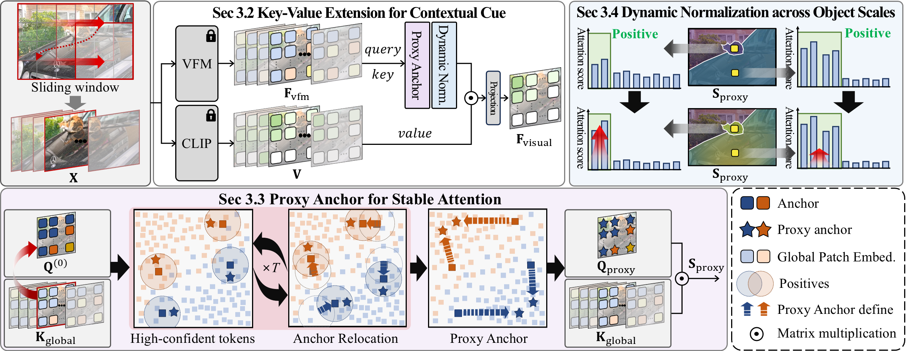

# Looking Beyond the Window: Global-Local Aligned CLIP for Training-free Open-Vocabulary Semantic Segmentation (CVPR 2026)
ByeongCheol Lee</sup>, Hyun Seok Seong</sup>, Sangeek Hyun</sup>, Gilhan Park</sup>, WonJun Moon</sup>, Jae-Pil Heo</sup>

[](https://arxiv.org/abs/2603.23030)
[](https://2btlfe.github.io/GLA-CLIP/) 

## ToDo
The whole contents of the code is now updated!! 
- [x] (2026.04.05) Upload 2 Crucial files (gla_clip_segmentor.py, open_clip/)
- [ ] Demo

## Main Figure
<p align="center">
  
</p>

## Abstract
> A sliding-window inference strategy is commonly adopted
in recent training-free open-vocabulary semantic segmentation methods to overcome limitation of the CLIP in processing high-resolution images. However, this approach introduces a new challenge: each window is processed independently, leading to semantic discrepancy across windows.
To address this issue, we propose Global-Local Aligned
CLIP (GLA-CLIP), a framework that facilitates comprehensive information exchange across windows. Rather
than limiting attention to tokens within individual windows,
GLA-CLIP extends key-value tokens to incorporate contextual cues from all windows. 
Nevertheless, we observe a
window bias: outer-window tokens are less likely to be attended, since query features are produced through interac-
tions within the inner window patches, thereby lacking semantic grounding beyond their local context. To mitigate
this, we introduce a proxy anchor, constructed by aggregating tokens highly similar to the given query from all
windows, which provides a unified semantic reference for measuring similarity across both inner- and outer-window
patches. Furthermore, we propose a dynamic normalization scheme that adjusts attention strength according to objectscale by dynamically scaling and thresholding the attention map to cope with small-object scenarios. Moreover,
GLA-CLIP can be equipped on existing methods and broad
their receptive field. Extensive experiments validate the effectiveness of GLA-CLIP in enhancing training-free open-
vocabulary semantic segmentation performance.
----------

## Dependencies and Installation
```
# git clone this repository
git clone https://github.com/2btlFe/GLA-CLIP.git
cd GLA-CLIP

# create new anaconda env
conda create -n GLA-CLIP python=3.10
conda activate GLA-CLIP

# install torch and dependencies
pip install -r requirements.txt
```

## Datasets
We include the following dataset configurations in this repo: 
1) `With background class`: PASCAL VOC, PASCAL Context, PASCAL Context 459 (PC459), Cityscapes, ADE20k, ADE847, and COCO-Stuff164k, 
2) `Without background class`: VOC20, Context59 (i.e., PASCAL VOC and PASCAL Context without the background category), and COCO-Object.

For PASCAL Context 459 and ADE847, please follow the [CAT-Seg](https://github.com/KU-CVLAB/CAT-Seg/tree/main/datasets) to prepare the datasets.
For the other datasets, please follow the [MMSeg data preparation document](https://github.com/open-mmlab/mmsegmentation/blob/main/docs/en/user_guides/2_dataset_prepare.md) to download and pre-process the datasets. 
The COCO-Object dataset can be converted from COCO-Stuff164k by executing the following command:

```
python datasets/cvt_coco_object.py PATH_TO_COCO_STUFF164K -o PATH_TO_COCO164K
```

The directory structure should look like:
```
📂 [default data dir]/
├── 📁 ADEChallengeData2016/
│   ├── images
│   ├── annotations
│   └── ...
├── 📁 VOCdevkit/
│   └── 📁 VOC2010
│       ├── JPEGImages
│       ├── ImageSets
│       └── ... 
├── 📁 VOC2012/
│   ├── JPEGImages
│   ├── ImageSets
│   └── ...
├── 📁 coco/
│   ├── annotations
│   └── val2017
├── 📁 coco_object/
│   ├── annotations
│   └── images
└── 📁 cityscapes/
    ├── gtFine
    └── leftImg8bit
```
By default, datasets are expected to be located in the `/TF_dataset` directory.

## Inference
```
bash predict.sh
```

## Citation
If you find this project useful, please consider the following citation:
```
@article{lee2026gla_clip,
  title={Looking Beyond the Window: Global-Local Aligned CLIP for Training-free Open-Vocabulary Semantic Segmentation},
  author={Lee, ByeongCheol, Seong, Hyun Seok, Hyun, Sangeek, Park, Gilhan, Moon, WonJun and Heo, Jae-Pil},
  booktitle={Proceedings of the IEEE/CVF Conference on Computer Vision and Pattern Recognition (CVPR)},
  year={2026}
}
```

## Acknowledgements
This repository is built based on [OpenCLIP](https://github.com/mlfoundations/open_clip), [ProxyCLIP](https://github.com/mc-lan/ProxyCLIP), [SCLIP](https://github.com/wangf3014/SCLIP). Thanks for the great work.
## License
This project is licensed under <a rel="license" href="https://github.com/mc-lan/SmooSeg/blob/master/LICENSE">NTU S-Lab License 1.0</a>. Redistribution and use should follow this license.
